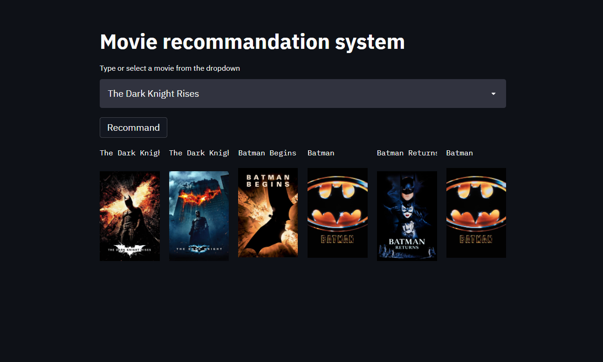

# Movie Recommandation System
- This web app helps you to get some movie recommandations based on your movie selection.
- This model is trained on TMDB dataset.
## How to Use:
- We need to select the movie from drop down and click on recomman button.
- then it auto suggest five most similar movies.

## Features:
- This is an content based recommandation system.
- It can help you to suggest movies based on your selection.
## Dataset and Api
- TMDB Kaggle Dataset
https://www.kaggle.com/tmdb/tmdb-movie-metadata?select=tmdb_5000_movies.csv

- Api key
"https://api.themoviedb.org/3/movie/{}?api_key=8265bd1679663a7ea12ac168da84d2e8&language=en-US".format(movie_id)

- Poster Path
"https://image.tmdb.org/t/p/w500/" + poster_path

    
## Deployment Demo
- The web app deployed using streamlit on heroku.
- https://movie-recommandation-system.herokuapp.com/
  
## Screenshots
### Movie Recommandation 

## Referance Taken From
- Mainly this project made by Nitish on youtube channel 
  CampusX.
- [Youtube Video Link](https://www.youtube.com/watch?v=1xtrIEwY_zY)
- [His Github Repo](https://github.com/campusx-official/movie-recommender-system-tmdb-dataset)
- [His Deployment Demo](https://mrs-campusx.herokuapp.com/)

  
